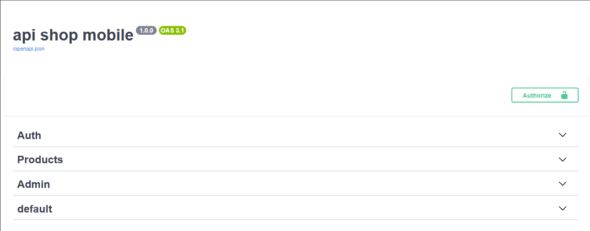
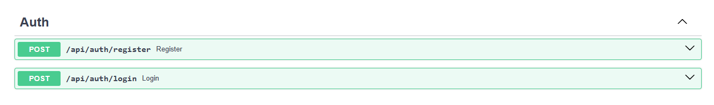
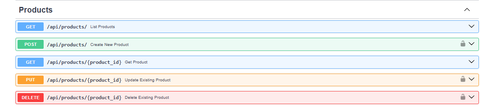
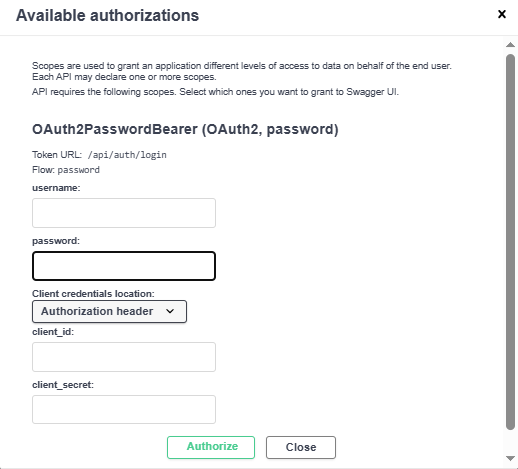

<<<<<<< HEAD

# 📱 Mobile Shop API

A modern RESTful API for an online mobile shop built with **FastAPI**. The project provides secure authentication, role-based authorization, and complete product management with a clean and scalable architecture.

---

## 🚀 Overview

This project simulates the backend of an online mobile store where users can browse products, authenticate using JWT, and administrators can manage the product catalog.

The application follows a modular architecture, making it easy to maintain, extend, and deploy using Docker.

---

## ✨ Features

### 🔐 Authentication & Authorization

- User Registration
- User Login
- JWT Access Token Authentication
- Password Hashing with BCrypt
- Protected Endpoints
- Role-Based Access Control (Admin/User)

### 👤 User Features

- Register a new account
- Login and receive JWT token
- Access protected endpoints
- Browse available products

### 🛒 Product Features

- Get all products
- Get product by ID
- Create new product (Admin Only)
- Update product (Admin Only)
- Delete product (Admin Only)

### 🛡 Security

- JWT Authentication
- Password Hashing
- Dependency-based Authorization
- Admin-only Routes
- Request Validation using Pydantic

---

# 🏗 Project Architecture

```
Client
   │
   ▼
FastAPI
   │
Authentication (JWT)
   │
Business Logic
   │
SQLAlchemy ORM
   │
PostgreSQL Database
```

The project follows a layered architecture:

```
app/
│
├── routers/
├── services/
├── models/
├── schemas/
├── database/
├── utils/
└── main.py
```

Each layer has a single responsibility, improving readability and maintainability.

---

# 🧰 Technologies Used

| Technology       | Purpose                    |
| ---------------- | -------------------------- |
| FastAPI          | REST API Framework         |
| Python           | Backend Language           |
| PostgreSQL       | Database                   |
| SQLAlchemy       | ORM                        |
| Alembic          | Database Migrations        |
| Pydantic         | Data Validation            |
| JWT              | Authentication             |
| Passlib (BCrypt) | Password Hashing           |
| Docker           | Containerization           |
| Docker Compose   | Multi-container Management |
| Uvicorn          | ASGI Server                |
| Git              | Version Control            |
| GitHub           | Source Code Hosting        |

---

# 🔑 Authentication Flow

```
Register
      │
      ▼
Password Hashing
      │
      ▼
Store User
      │
      ▼
Login
      │
      ▼
Verify Password
      │
      ▼
Generate JWT
      │
      ▼
Protected Endpoints
```

---

# 👮 Authorization

Two user roles are supported:

### User

- View Products
- Access authenticated endpoints

### Admin

- Create Products
- Update Products
- Delete Products
- Manage product catalog

---

# 📦 API Endpoints

## Authentication

| Method | Endpoint             | Description           |
| ------ | -------------------- | --------------------- |
| POST   | `/api/auth/register` | Register new user     |
| POST   | `/api/auth/login`    | Login and receive JWT |

---

## Products

| Method | Endpoint             | Access |
| ------ | -------------------- | ------ |
| GET    | `/api/products`      | Public |
| GET    | `/api/products/{id}` | Public |
| POST   | `/api/products`      | Admin  |
| PUT    | `/api/products/{id}` | Admin  |
| DELETE | `/api/products/{id}` | Admin  |

---

# 🐳 Running with Docker

```bash
docker compose up --build
```

The API will be available at:

```
http://localhost:8000
```

Swagger UI:

```
http://localhost:8000/docs
```

ReDoc:

```
http://localhost:8000/redoc
```

---

# 📸 API Documentation

## Swagger Home



---

## Authentication Endpoints



---

## Product Endpoints



---

## Authorized Request



---

# 🔮 Future Improvements

- Shopping Cart
- Categories
- Product Images
- Product Search
- Pagination
- Refresh Tokens
- Email Verification
- Order Management
- Payment Gateway Integration
- Unit Tests
- GitHub Actions (CI)
- Automatic Deployment (CD)

---

# 📚 Learning Goals

This project was built to practice:

- REST API Design
- Authentication & Authorization
- Clean Project Structure
- Docker
- PostgreSQL
- SQLAlchemy ORM
- API Documentation
- Backend Best Practices

---

# 🤝 Contributing

Contributions, issues, and feature requests are welcome.

Feel free to fork the repository and submit a pull request.

---

# 📄 License

This project is licensed under the MIT License.

---

## 👨‍💻 Author

**Reza Movaheddi**

GitHub:
https://github.com/rezamovaheddi
